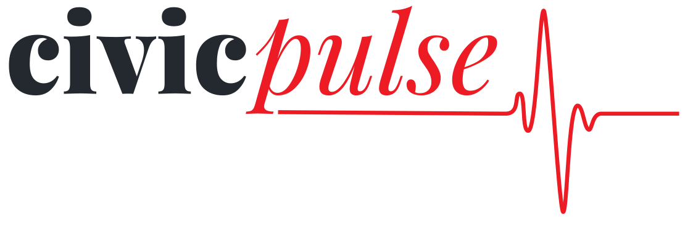

<div align="center">
  

  <p><strong>Know What Congress Is Doing</strong> - An AI-powered civic engagement platform that makes congressional activity accessible to everyone.</p>

  
  
  
  
</div>

Built for [The AI Champion Ship Hackathon](https://liquidmetal.devpost.com/) - showcasing AI for Public Good and Voice Agent capabilities.

## 🎯 The Problem

Congressional bills are complex, inaccessible, and overwhelming. The average American doesn't have time to read 40-page legislative documents or track what their representatives are doing. This creates a disconnect between citizens and their government.

## 💡 Our Solution

Civic Pulse transforms congressional activity into digestible, personalized content:

- **📊 Track Bills** - Follow legislation that matters to you across 15 policy areas
- **👥 Know Your Reps** - See who represents you and how they vote
- **🎧 Audio Briefings** _(optional)_ - NPR-quality daily/weekly summaries perfect for your commute
- **🔔 Smart Notifications** - Get alerts when bills you care about have updates

## ✨ Features

### For Citizens
- **Personalized Onboarding** - Enter your zip code, select interests, set preferences
- **Bill Tracking** - Real-time updates from Congress.gov on legislation
- **Representative Profiles** - Contact info, voting records, committee assignments
- **Audio Briefings** - AI-generated podcasts with dual hosts (Sarah & James)
- **Email Notifications** - Stay informed without app fatigue

### Technical Highlights
- **Accessibility First** - WCAG compliant, keyboard navigation, screen reader support
- **Mobile-First Design** - 44px touch targets, responsive from iPhone SE to desktop
- **Real-time Data** - Direct integration with Congress.gov API
- **Smart Caching** - 24-hour cache for fast performance within rate limits
- **Serverless Architecture** - Built on Raindrop Platform for instant scaling

## 🛠️ Tech Stack

### Frontend
- **[Next.js 16](https://nextjs.org/)** - React framework with App Router
- **[React 19](https://react.dev/)** - Latest features including auto-configuration
- **[TypeScript](https://www.typescriptlang.org/)** - Type safety in strict mode
- **[Tailwind CSS](https://tailwindcss.com/)** - Utility-first styling
- **[shadcn/ui](https://ui.shadcn.com/)** - Accessible component library
- **[Lucide React](https://lucide.dev/)** - Beautiful icon system

### Backend & Infrastructure
- **[Raindrop Platform](https://raindrop.ai/)** - Serverless backend (SmartSQL, AI, Storage)
- **[Netlify](https://www.netlify.com/)** - Deployment and hosting
- **[Vultr Object Storage](https://www.vultr.com/)** - Audio file storage + CDN
- **[WorkOS](https://workos.com/)** - OAuth authentication (Google, Twitter)

### AI & Voice
- **[Claude Sonnet 4](https://www.anthropic.com/claude)** - Bill analysis and dialogue generation
- **[ElevenLabs](https://elevenlabs.io/)** - Text-to-dialogue for natural audio briefings

### External APIs
- **[Congress.gov API](https://api.congress.gov/)** - Official legislative data
- **[Stripe](https://stripe.com/)** - Payment processing for premium features

## 🚀 Getting Started

### Prerequisites

- Node.js 20+
- npm, pnpm, yarn, or bun
- Git

### Installation

```bash
# Clone the repository
git clone https://github.com/tmoody1973/civicpulse.git
cd civicpulse

# Install dependencies
npm install

# Copy environment variables
cp .env.example .env.local

# Start development server
npm run dev
```

Visit [http://localhost:3001](http://localhost:3001) to see the app.

### Environment Variables

Required environment variables (see `.env.example`):

```bash
# Raindrop Platform
RAINDROP_SQL_URL=
RAINDROP_SMART_MEMORY_URL=

# Vultr Object Storage
VULTR_STORAGE_ENDPOINT=
VULTR_ACCESS_KEY=
VULTR_SECRET_KEY=
VULTR_CDN_URL=

# External APIs
CONGRESS_API_KEY=
ANTHROPIC_API_KEY=
ELEVENLABS_API_KEY=
ELEVENLABS_SARAH_VOICE_ID=
ELEVENLABS_JAMES_VOICE_ID=

# Authentication
WORKOS_API_KEY=
WORKOS_CLIENT_ID=
WORKOS_REDIRECT_URI=
NEXT_PUBLIC_WORKOS_CLIENT_ID=

# Payments
STRIPE_SECRET_KEY=
STRIPE_WEBHOOK_SECRET=
NEXT_PUBLIC_STRIPE_PUBLISHABLE_KEY=

# App Config
NEXT_PUBLIC_APP_URL=https://civicpulse.netlify.app
```

## 🏗️ Project Structure

```
civicpulse/
├── app/                      # Next.js App Router pages
│   ├── onboarding/          # User onboarding flow
│   ├── dashboard/           # Main dashboard
│   └── api/                 # API routes
├── components/
│   ├── ui/                  # shadcn/ui primitives
│   ├── onboarding/          # Onboarding step components
│   ├── landing/             # Landing page sections
│   └── shared/              # Reusable components
├── lib/                     # Utilities and helpers
├── src/web/                 # Raindrop backend service
│   └── index.ts            # Main service entry point
├── raindrop.manifest        # Raindrop infrastructure config
└── public/                  # Static assets
```

## 📱 Responsive Design

Tested and optimized for:
- **iPhone SE** (375px) - Smallest modern device
- **iPhone 15 Pro** (393px) - Current standard
- **iPad** (768px) - Tablet experience
- **Desktop** (1920px+) - Full-screen layout

## ♿ Accessibility

- **WCAG 2.1 AA Compliant** - Following Web Content Accessibility Guidelines
- **Keyboard Navigation** - Full functionality without mouse
- **Screen Reader Support** - Proper ARIA labels and semantic HTML
- **Touch Targets** - Minimum 44x44px for mobile usability
- **Color Contrast** - Meets accessibility standards

## 🎨 Issue Categories

Comprehensive coverage of congressional policy areas:

**Column 1:**
- Healthcare
- Education
- Science & Research
- Technology & Privacy
- Climate & Environment

**Column 2:**
- Economy & Jobs
- Business & Trade
- Taxes & Budget
- Immigration
- Housing

**Column 3:**
- Defense & Security
- Transportation & Infrastructure
- Agriculture & Food
- Social Services
- Civil Rights & Justice

## 🧪 Development

```bash
# Run development server
npm run dev

# Type check
npm run type-check

# Lint
npm run lint

# Build for production
npm run build

# Start production server
npm start
```

## 🚢 Deployment

### Netlify (Recommended)

```bash
# Login to Netlify
netlify login

# Initialize site
netlify init

# Deploy preview
netlify deploy

# Deploy to production
netlify deploy --prod
```

### Environment Variables on Netlify

```bash
# Set all environment variables
netlify env:set CONGRESS_API_KEY "your-key"
netlify env:set ANTHROPIC_API_KEY "your-key"
# ... (repeat for all variables)
```

## 📊 Performance Targets

- **Page Load**: < 2s (Lighthouse 90+)
- **Podcast Generation**: < 60s daily, < 120s weekly
- **API Response**: < 500ms (non-generative)
- **Database Queries**: < 100ms
- **Audio Streaming**: < 1s to first byte

## 🤝 Contributing

This project was built for The AI Champion Ship. While we're not accepting contributions during the judging period, we welcome feedback and suggestions!

### Development Workflow

1. Read `CLAUDE.md` for development guidelines
2. Follow conventional commits format
3. Ensure accessibility standards are met
4. Test on mobile devices
5. Update `journal.md` for significant changes

## 📄 License

MIT License - see [LICENSE](LICENSE) file for details

## 🏆 Hackathon Categories

- **🎤 Voice Agent** - ElevenLabs text-to-dialogue for natural multi-host conversations
- **🌍 AI for Public Good** - Improving civic engagement and government transparency

## 🙏 Acknowledgments

- **[The AI Champion Ship](https://liquidmetal.devpost.com/)** - For hosting this amazing event
- **[Raindrop Platform](https://raindrop.ai/)** - Serverless backend infrastructure
- **[Netlify](https://www.netlify.com/)** - Deployment and hosting sponsor
- **[Vultr](https://www.vultr.com/)** - Object storage and CDN sponsor
- **Congress.gov** - For providing free, accessible legislative data

## 📞 Contact

- **Developer**: Tarik Moody
- **GitHub**: [@tmoody1973](https://github.com/tmoody1973)
- **Project**: [Civic Pulse](https://github.com/tmoody1973/civicpulse)

---

**Built with ❤️ for civic engagement** | Making Congress accessible to everyone
